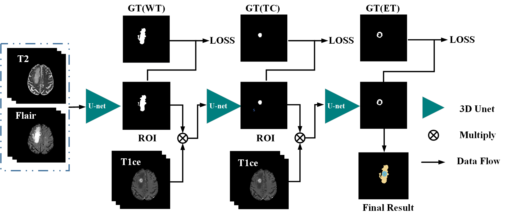

# Multi-step cascaded network for brain tumor segmentations  with tensorflow

This is an implementation of our BraTS2019 paper ["Multi-step Cascaded Networks for Brain Tumor segmentation"](https://arxiv.org/abs/1908.05887) on Python3, tensorflow, and Keras.


<p align="center">
    
</p>

<p align="center">
     Whole Tumor........................Tumor  Core ......................Enhancing Tumor
</p>


## Schematic of the proposed method    

<p align="center">
    
</p>


## Requirements  

Python3.5,  Tensorflow 1.12  and other common packages  which can be seen in [`requirements.txt`](requirements.txt)


## Getting started  

+ [parameters.ini](src/tr_param_brain.ini)   is the configuration file.
+ [main.py](src/main.py)   is the main function of the program.
+ [oprations.py](src/model.py)  builds the model and  is responsible for the training and the testing phase.
+ [utils.py](src/utils.py)  provides lots of useful functions  which is utilized in the program.
+ [models.py](src/ops.py)  provides some combinations of  multiple layers and model achitecture.
+ [seg_eval.py](src/seg_eval.py)  provides some APIs to calculate the metrics, e.g. DIce, Sensitivity, etc.


## Training

The network is trained on the Brain Tumor Segmentation Challenge 2019(Brats2019)  training dataset which  can be downloaded from  [Brats2019 web page](http://www.braintumorsegmentation.org/) .

(1)  Edit [`parameters.ini`](src/parameters.ini) so as to be consistent with your local environment, especially the "phase", "traindata_dir " and "testdata_dir ", for example:

```python
phase = train
traindata_dir =  /home/xxx/Dataset/BraTS2019_train/train
testdata_dir =  /home/xxx/Dataset/mix/test
```

**notice** : folder structure of the training or testing data should be like this:

train/test-----HGG/LGG----BraTS19_XXX_X_X---BraTS19_XXX_X_X_flair.nii.gz

​                                                                            ---BraTS19_XXX_X_X_t1.nii.gz

​																			---BraTS19_XXX_X_X_t1ce.nii.gz

​																			---BraTS19_XXX_X_X_t2.nii.gz

(2) Run `main.py `  in the command line or in the python IDE directly.

```python
python main.py
```


## Testing

(1)  Edit [`parameters.ini`](src/parameters.ini) so as to be consistent with your local environment, especially the "phase", "traindata_dir " and "testdata_dir ", for example:

```python
phase = test
traindata_dir =  /home/xxx/Dataset/BraTS2019_train/train
testdata_dir =  /home/xxx/Dataset/mix/test
```

(2) Run `main.py `  in the command line or in the python IDE directly.

```python
python main.py
```


## Results

The proposed method was validated on the Brats2019 evaluation platform, the preliminary results on training and validation sets are as follows:       

| Dice Coefficient |    WT     |    TC     |    ET     |
| :--------------: | :-------: | :-------: | :-------: |
|     Training     | **0.915** |   0.832   |   0.791   |
|    Validation    |   0.886   | **0.813** | **0.771** |

To better illustrate the results of the proposed method, we made a qualitative analysis of the segmentation results, which can be seen as follows:

<p align="center">
    
</p>


## Troubleshooting 

If you meet any questions when you run this code ,   please don't hesitate  to raise a new issue in the repository or directly contact us at lxycust@gmail.com.


## Citations

Please consider citing this project in your publications if it helps your research. The following is a BibTeX reference. The BibTeX entry  requires the `url` LaTeX package.

```latex
@article{li2019multi,
  title={Multi-step Cascaded Networks for Brain Tumor Segmentation},
  author={Li, Xiangyu and Luo, Gongning and Wang, Kuanquan},
  journal={arXiv preprint arXiv:1908.05887},
  year={2019}
}
```